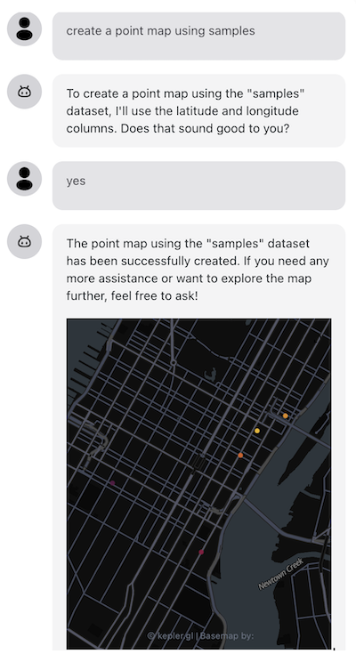

Are you looking to create stunning maps from your data without writing complex visualization code? We're excited to introduce the KeplerGL plugin for OpenAssistant, which lets you generate beautiful maps through simple conversations with your AI assistant!

<!--truncate-->

## What's OpenAssistant?

OpenAssistant is an open-source platform for building AI assistants. It provides a set of tools and libraries to help you build your own AI assistant.

Unlike general-purpose chatbots such as ChatGPT or Google Gemini, OpenAssistant takes a different approach. It's specifically engineered to be the bridge between Large Language Models (LLMs) and your application's functionality. Think of it as your application's AI co-pilot that can not only chat with users but also execute complex tasks by leveraging your app's features and external AI plugins.

## What's KeplerGL?

Kepler.gl is a powerful open-source geospatial analysis tool that helps you visualize large-scale location data. When combined with OpenAssistant, you can create maps by simply asking your AI assistant - no manual configuration required!

## See It in Action

Let's say you have location-based data about venues, including their revenue and population:

```json
const myDatasets = {
  myVenues: [
    { "location": "New York", latitude: 40.7128, longitude: -74.0060, revenue: 100000, population: 8000000 },
    { "location": "Los Angeles", latitude: 34.0522, longitude: -118.2437, revenue: 150000, population: 4000000 },
    { "location": "Chicago", latitude: 41.8781, longitude: -87.6298, revenue: 120000, population: 2700000 }
  ]
};
```

With the KeplerGL plugin, you can simply ask your AI assistant:
> "Can you create a map using the data myVenues?"

And voilà! The assistant will generate a map visualization for you.



## Getting Started

Let's walk through how to integrate this into your application:

### 1. Set Up Your AI Assistant

First, configure your OpenAssistant with the necessary properties:

```typescript
const assistantProps = {
  name: 'My AI Assistant',
  modelProvider: 'openai',
  model: 'gpt-4',
  apiKey: 'your-api-key',
  instructions: "You are a data and map analyst. You can help users to create a map from a dataset.",
  functions: [], // We'll add the mapping functions later
};
```

### 2. Share Your Dataset Metadata

The AI assistant needs to know about your available datasets:

```typescript
const dataContext = [
  {
    description: 'Please use the following meta data for function callings.',
    metaData: [
      {
        datasetName: 'myVenues',
        fields: ['name', 'longitude', 'latitude', 'revenue', 'population'],
      },
    ],
  },
];
```

### 3. Add the KeplerGL Plugin

Import and configure the mapping function:

```typescript
import { createMapFunctionDefinition } from '@openassistant/keplergl';

const myFunctions = [
  createMapFunctionDefinition({
    getDataset: ({datasetName}) => {
      return myDatasets[datasetName];
    },
  })
];
```

### 4. Put It All Together

Finally, update your assistant props and render the component:

```typescript
assistantProps.functions = myFunctions;
return <AiAssistant {...assistantProps} />;
```

## Start Creating Maps!

That's it! Now you can start a conversation with your AI assistant and create maps by simply asking. Try prompts like:
- "Create a map showing all venues"
- "Show me a map of revenue by location"
- "Visualize the population distribution"

## What's Next?

We're continuously working on improving the KeplerGL plugin with more features and configuration options. Stay tuned for updates that will bring even more mapping capabilities to your AI assistant!

Want to learn more? Check out our [detailed documentation](/docs/tutorial-extras/keplergl-plugin) for advanced configurations and examples.

Happy mapping with OpenAssistant! 🗺️