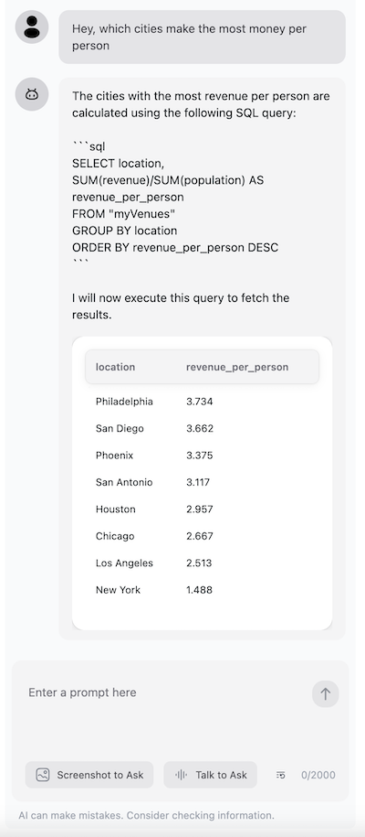

Ever wished you could just chat with your data like you're talking to a friend? Imagine your users can ask "Hey, which city has the highest revenue?" and getting an instant answer from your data! With our new DuckDB plugin for OpenAssistant, you can do exactly that! 🚀

<!--truncate-->

## The Magic Behind the Scenes

Before we dive in, let me introduce you to two amazing tools that make this magic happen:

**OpenAssistant** is like your personal AI co-pilot. Think of it as a super-smart friend who not only understands what you're asking but can also help you get things done. It's different from regular chatbots because it can actually work with your app's features!

**DuckDB** is our data superhero - it's a lightning-fast database that can crunch numbers and analyze data in the blink of an eye. When we combine it with OpenAssistant, you get to ask questions in plain English and get answers instantly! ⚡

## See the Magic in Action!

Let's say you have some city data like this:

```json
const myDatasets = {
  myVenues: [
    { "location": "New York", "latitude": 40.7128, "longitude": -74.0060, "revenue": 12500000, "population": 8400000 },
    { "location": "Los Angeles", "latitude": 34.0522, "longitude": -118.2437, "revenue": 9800000, "population": 3900000 },
    { "location": "Chicago", "latitude": 41.8781, "longitude": -87.6298, "revenue": 7200000, "population": 2700000 }
  ]
};
```

Instead of writing complex SQL queries, you can simply ask:
> "Hey, which cities make the most money per person?"

And boom! 💥 Your AI assistant figures out the SQL, runs the query, and shows you the results!



## Let's Build Something Cool! 🛠️

Ready to create your own AI data analyst? It's easier than you think! Let's break it down into bite-sized pieces:

### 1. Get Everything You Need

First, grab our packages (it's just one line!):

```bash
yarn add @openassistant/core @openassistant/ui @openassistant/duckdb
```

### 2. Set Up Your AI Assistant

Think of this as introducing yourself to your new AI friend:

```typescript
const assistantProps = {
  name: 'My Data Buddy', // Give it a fun name!
  modelProvider: 'openai',
  model: 'gpt-4',
  apiKey: 'your-api-key',
  instructions: "You're a friendly data helper who loves explaining insights in simple terms!",
  functions: [], // We'll add the cool stuff here soon
};
```

Add some instructions specifically for the query task and your datasets.

### 3. Tell Your Assistant About Your Data

This is like giving your AI friend a map of what data it can explore:

```typescript
const dataContext = [
  {
    description: 'Here are the datasets we can play with:',
    metaData: [
      {
        datasetName: 'myVenues',
        fields: ['location', 'latitude', 'longitude', 'revenue', 'population'],
      },
    ],
  },
];
```

### 4. Add the Magic (DuckDB Plugin)

Here's where we give our assistant its superpowers:

```typescript
import { queryDuckDBFunctionDefinition } from '@openassistant/duckdb';

const myFunctions = [
  queryDuckDBFunctionDefinition({
    getValues: (datasetName, variableName) => {
      return myDatasets[datasetName]; // Your data goes here!
    },
  })
];
```

### 5. Put It All Together

The final piece of the puzzle:

```typescript
assistantProps.functions = myFunctions;
return <AiAssistant {...assistantProps} />;
```

## Time to Play! 🎮

Now for the fun part! Try asking your AI data buddy questions like:
- "Which city is the most crowded?"
- "Show me cities making more than $10M"
- "What's the average population of all cities?"

The best part? No SQL knowledge needed - just ask in plain English! 

## Cool Features Coming Soon! 🎯

We're cooking up even more awesome features for the DuckDB plugin. Think data visualizations, more complex analyses, and maybe even some AI-powered predictions! Stay tuned! 

Want to become a data wizard? Check out our [super-friendly documentation](/docs/tutorial-extras/duckdb-plugin) for more cool tricks and tips!

Ready to start chatting with your data? Let's go! 🚀

P.S. If you build something cool with this, we'd love to see it! Share your creations with us! 🌟
