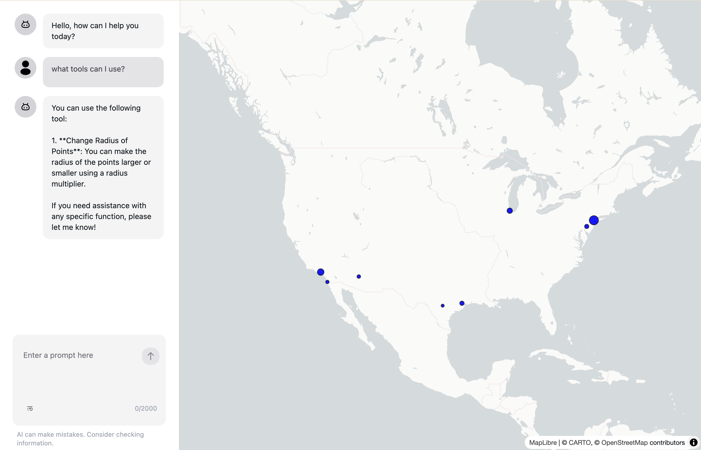

Deck.gl is a powerful WebGL-based library for large-scale data visualization on maps. While it offers extensive capabilities, users often need to write complex code to interact with the visualizations. In this tutorial, we'll create an AI-powered assistant using OpenAssistant that can understand natural language commands to manipulate a Deck.gl map - from adjusting point sizes to filtering data through interactive visualizations.


<!--truncate-->

# Prerequisites

Before we begin, make sure you have:
- Basic knowledge of React and TypeScript
- Node.js 16 or higher installed
- A package manager (npm, yarn, or pnpm)
- An API key for your chosen AI model provider

# Project Setup

Let's create a React application that combines Deck.gl's visualization capabilities with OpenAssistant's AI features.

## Setup the project

We will use the Deck.gl library and OpenAssistant library to build the example project.

Suppose your react project has the following structure:

```
deckgl-assistant
├── src
│   ├── app.tsx
│   └── index.css
├── public
│   └── index.html
├── package.json
├── tsconfig.json
└── tailwind.config.js
```

## Add Deck.gl and OpenAssistant to your project

1. Install Deck.gl

```bash
yarn add @deck.gl/core @deck.gl/layers @deck.gl/react @deck.gl/widgets react-map-gl maplibre-gl
```

2. Install OpenAssistant

```bash
yarn add @openassistant/core @openassistant/ui
```

3. Setup Tailwind CSS

Edit the `tailwind.config.js` file to include the following:

```js
import { nextui } from '@nextui-org/react';

/** @type {import('tailwindcss').Config} */
module.exports = {
  content: [
    './src/**/*.{js,ts,jsx,tsx}',
    './node_modules/@nextui-org/theme/dist/**/*.{js,ts,jsx,tsx}',
    './node_modules/@openassistant/ui/dist/**/*.{js,ts,jsx,tsx}',
  ],
  theme: {
    extend: {},
  },
  darkMode: 'class',
  plugins: [nextui()],
};
```

## Add the Deck.gl map and OpenAssistant UI to your project

### 1. Add a basic Deck.gl map to visualize points data

Suppose you have a points dataset in the file `dataset.ts` with the following content:

```ts
export const SAMPLE_DATASETS = {
  myVenues: [
    {
      index: 0,
      location: 'New York',
      latitude: 40.7128,
      longitude: -74.006,
      revenue: 12500000,
      population: 8400000,
    },
    {
      index: 1,
      location: 'Los Angeles',
      latitude: 34.0522,
      longitude: -118.2437,
      revenue: 9800000,
      population: 3900000,
    },
  ],
};
```

You can edit the `app.tsx` file to include the following code to visualize the points data:

```tsx
import DeckGL from '@deck.gl/react';
import { ScatterplotLayer } from '@deck.gl/layers';
import { Map } from 'react-map-gl/maplibre';
import { SAMPLE_DATASETS } from './dataset';

type PointData = {
  index: number;
  longitude: number;
  latitude: number;
  revenue: number;
  population: number;
};

export function App() {
  // Initial viewport state
  const initialViewState = {
    longitude: -98.5795, // Center of continental US
    latitude: 39.8283, // Center of continental US
    zoom: 3, // Zoomed out to show entire country
    pitch: 0,
    bearing: 0,
  };

  // Sample data point
  const data = SAMPLE_DATASETS.myVenues;

  // Base map style
  const mapStyle =
    'https://basemaps.cartocdn.com/gl/positron-nolabels-gl-style/style.json';

  // Create a scatterplot layer
  const layers = [
    new ScatterplotLayer<PointData>({
      id: 'scatter-plot',
      data,
      pickable: true,
      opacity: 0.8,
      stroked: true,
      filled: true,
      radiusScale: 1,
      radiusMinPixels: 1,
      radiusMaxPixels: 100,
      lineWidthMinPixels: 1,
      getPosition: (d: PointData) => [d.longitude, d.latitude],
      getRadius: (d: PointData) => d.revenue / 200,
      getFillColor: [255, 0, 0],
      getLineColor: [0, 0, 0],
    }),
  ];

  return (
    <div className="flex flex-row w-screen h-screen">
      <div className="deckgl h-full w-full">
        <DeckGL
          initialViewState={initialViewState}
          controller={true}
          layers={layers}
          style={{ position: 'relative' }}
        >
          <Map reuseMaps mapStyle={mapStyle} />
        </DeckGL>
      </div>
    </div>
  );
}
```

This will create a basic Deck.gl map with a scatterplot layer. If you run the project, you will see a map with points on it.


### 2. Add the OpenAssistant UI to your project

Edit the `app.tsx` file to include the following code to add the OpenAssistant UI. For details about the OpenAssistant UI, please refer to the [OpenAssistant UI documentation](https://openassistant.github.io/ui/).

```tsx
import DeckGL from '@deck.gl/react';
import { ScatterplotLayer } from '@deck.gl/layers';
import { Map } from 'react-map-gl/maplibre';
import { SAMPLE_DATASETS } from './dataset';

import { AiAssistant } from '@openassistant/ui';

...

  return (
    <div className="flex flex-row w-screen h-screen">
      <div className="w-[400px] h-[800px] m-4">
        <AiAssistant
          name="My Assistant"
          apiKey="your-api-key"
          version="v1"
          modelProvider="openai"
          model="gpt-4o"
          welcomeMessage="Hello, how can I help you today?"
          instructions=""
          functions={[]}
        />
      </div>
      <div className="deckgl h-full w-full">
        <DeckGL
          initialViewState={initialViewState}
          controller={true}
          layers={layers}
          style={{ position: 'relative' }}
        >
          <Map reuseMaps mapStyle={mapStyle} />
        </DeckGL>
      </div>
    </div>
  );
}
```

This will add the OpenAssistant UI to the project. If you run the project, you will see the OpenAssistant UI on the left side of the screen.


If you provide the `apiKey` for your selected model, you will be able to chat with the OpenAssistant.

## Let the AI Assistant know about your data

You can let the AI Assistant know about your data by providing the `instructions` to the OpenAssistant UI.

For example, you can let the AI Assistant know about the data in the `dataset.ts` file by providing the following instructions:

```tsx
const instructions = `
You are a helpful assistant that can help me with my questions.

Here is the data you can use to answer my questions:
Dataset Name: myVenues
Fields:
- index
- location
- longitude
- latitude
- revenue
- population
`;

...
<AiAssistant
  name="My Assistant"
  apiKey="your-api-key"
  version="v1"
  modelProvider="openai"
  model="gpt-4o"
  welcomeMessage="Hello, how can I help you today?"
  instructions={instructions}
  functions={[]}
/>
...
```

:::tip
The meta data is good enough for the AI Assistant to understand your data and the tasks you want to add later. Don't put the entire dataset in the context, and there is no need to share your dataset with the AI Assistant or the LLM models. This also helps to keep your dataset private.
:::

For example, you can ask LLM what data are avaiable to use:


:::tip
For dynamic data, you can create a callback function to get the data from your backend, and then append the meta data to the instructions.
:::

## Let the AI Assistant help you with your task

LLM is very powerful, but it does not know the details of your data (only meta data is shared), and specific tasks you want to achieve in your application. Normally, developers provid a well-designed UI system to let users to interact with the map e.g. change color scale, filter data, etc. (Kepler.gl is a good example). In this blog post, we will show you how to "program" the AI Assistant for your specialized tasks, so users just need to provide natural language prompts to achieve the task in your application.

For example, the radius of the points on the map is defined as `d.revenue / 200`, and you want to let users to change the radius of the points on the map. For example, users can ask:

```
Can you make the radius of the points on the map larger?
```

### How does the AI Assistant know what to do?

Some LLM models provide a feature called `tool calling`, which is a feature that allows the model to call a function with specific arguments.

When user prompts a question, the LLM model will understand if the question can be answered by one of the `tools` that you provided. If so, the LLM model will call the function with the arguments that LLM model thinks are most likely from the user's prompt.

In order to let the AI Assistant to change the radius of the points on the map from the user's prompt above, you need to define a function that can change the radius of the points on the map first.

> OpenAssistant follows the OpenAI's [function calling](https://platform.openai.com/docs/guides/function-calling) standard, so you can refer to the [OpenAI function calling documentation](https://platform.openai.com/docs/guides/function-calling) for more details.

```tsx
const callbackFunction = async (props) => {
  return '';
}

const callbackFunctionContext = {};

...
<AiAssistant
  name="My Assistant"
  apiKey="your-api-key"
  version="v1"
  modelProvider="openai"
  model="gpt-4o"
  welcomeMessage="Hello, how can I help you today?"
  instructions={instructions}
  functions={[
    {
      name: 'changeRadius',
      description: 'Make the radius of the points larger or smaller',
      properties: {
        radiusMultiplier: {
          type: 'number',
          description: 'The multiplier for the radius of the points',
        },
      },
      required: ['radiusMultiplier'],
      callbackFunction,
      callbackFunctionContext,
    }
  ]}
/>
...
```

The difference of this function call definition is that OpenAssistant allows you to pass in the `callbackFunction` (required) and `callbackFunctionContext` (optional) to the AI Assistant.

By providing the `functions` to the LLM model, the LLM model will understand what function tools are available and it will try to call the function to answer the user's prompt.

For example, now if you ask the AI Assistant:

```
What tools are available to use?
```



The LLM model will respond with the available tools you defined in the `functions` array.

### Understanding Function Calling in AI Assistants

When we provide function definitions to the AI assistant, we're essentially teaching it about the available actions it can take in our application. The assistant analyzes user requests and determines whether they map to any of these predefined functions.

For example, when a user asks "Can you make the points bigger?", the assistant:
1. Recognizes this as a request to modify point size
2. Maps this to our `changeRadius` function
3. Determines appropriate parameters (like setting radiusMultiplier to a larger value)
4. Calls the function with these parameters

This creates a natural language interface for our technical functionality.

### Implement the callback function

Now, LLM knows that it has a tool to change the radius of the points on the map, and it will call your function provided as `callbackFunction` to change the radius of the points on the map.

You need to implement the `callbackFunction` to actually change the radius of the points on the map.

For example, you can implement the `callbackFunction` to change the radius of the points on the map by updating the `radiusMultiplier` in the `callbackFunctionContext`.

```tsx
...
export function App() {
  // Add state for radius multiplier
  const [radiusMultiplier, setRadiusMultiplier] = useState<number>(1);

  ...
  // define the callback function
  const callbackFunction = async (props) => {
    const { functionName, functionArgs } = props;
    const { radiusMultiplier } = functionArgs;
    // check if LLM calls the right function name
    if (functionName !== 'changeRadius') {
      // tell LLM the function call is not valid
      return {
        type: 'error',
        result: `Invalid function name: ${functionName}`,
      };
    }
    // update the radius multiplier
    setRadiusMultiplier(radiusMultiplier);
    // tell LLM the function is called successfully with the result
    return {
      type: 'success',
      result: `Radius multiplier set to ${radiusMultiplier}`,
    };
  }

  const callbackFunctionContext = {};
  ...
  // Create a scatterplot layer
  const layers = [
    new ScatterplotLayer<PointData>({
      id: 'scatter-plot',
      ...
      getPosition: (d: PointData) => [d.longitude, d.latitude],
      // use radiusMultiplier
      getRadius: (d: PointData) => (d.revenue / 200) * radiusMultiplier,
      getFillColor: [255, 0, 0],
      getLineColor: [0, 0, 0],
      // trigger rerender when radiusMultiplier changes
      updateTriggers: {
        getRadius: [radiusMultiplier],
      },
    }),
  ];
  ...
}
```

Now, you can change the radius of the points on the map by providing the following prompt:

```
Can you make the radius of the points on the map larger?
```


The LLM model will call the `changeRadius` function with the argument `radiusMultiplier` set to the value that is determined from the user's prompt or a certain value (e.g. 1.5 in the above screenshot) by the LLM model.

:::tip
You can ask the LLM model to always confirm the function call and the arguments before calling the function by adding instruction to the LLM model.
:::

```tsx
const instructions = `
You are a helpful assistant that can help me with my questions.

Please confirm the function call and the arguments before calling the function.

Here is the data you can use to answer my questions:
Dataset Name: myVenues
Fields:
- index
- location
- longitude
- latitude
- revenue
- population
`;
```

### Using the callbackContext

The `callbackContext` is a context that can be passed to the callback function. You can pass the state or any async data, e.g. data from the backend, of the application to the callback function.

For example, if you want to implement a task that allows the user to highlight the point for a given state, e.g.

```
Can you highlight the points for the state of California?
```

You can use the `callbackContext` to pass the latitude and longitude of the points to the callback function and then use the latitude and longitude to highlight the points.

:::note
The context is only available in the callback function, which is executed within your application (in the browser). It is not sent to the LLM model.
:::

Let's define a function to return the definition of this tool:

```tsx
function filterByStateFunctionDefinition(
  callbackFunction,
  callbackFunctionContext
) {
  return {
    name: 'filterByState',
    description: 'Filter points by state',
    properties: {
      state: {
        type: 'string',
        description: 'The state to filter the points by',
      },
      boundingBox: {
        type: 'array',
        description: 'The bounding box coordinates of the state. The format is [minLongitude, minLatitude, maxLongitude, maxLatitude]. If not provided, please try to use approximate bounding box of the state.',
        items: {
          type: 'number',
        },
      },
    },
    required: ['state'],
    callbackFunction,
    callbackFunctionContext,
  };
}
```

Now, let's provide the callback function and context for this function to implement the task.

```tsx
const filterByStateCallbackFunctionContext = {
  points: SAMPLE_DATASETS.myVenues,
};

function filterByStateCallback(props) {
  const { functionName, functionArgs, functionContext } = props;
  const { state, boundingBox } = functionArgs;
  const { points } = functionContext;
  // get the index of the points that fits inside the bounding box
  const filteredIndices = points
    .filter((point) => {
      const isInside =
        point.latitude >= boundingBox[0] &&
        point.latitude <= boundingBox[1] &&
        point.longitude >= boundingBox[2] &&
        point.longitude <= boundingBox[3];
      return isInside;
    })
    .map((point) => point.index);

  // highlight the filtered points
  // highlightPoints(filteredIndices);

  return {
    type: 'success',
    result: `${filteredIndices.length} points are filtered by state ${state} and bounding box ${boundingBox}`,
  };
}
```

With the callback function and context, you can now ask LLM to highlight the points for a given state. However, to really highlight the points in Deck.gl, you will need to implement the `highlightPoints` function that is commented out in the above code.

```tsx
// Add state for filtered indices
const [filteredIndices, setFilteredIndices] = useState<number[]>([]);

function highlightPoints(indices: number[]) {
  // highlight the points
  setFilteredIndices(indices);
}

// Create a scatterplot layer
const layers = [
  new ScatterplotLayer<PointData>({
    id: 'scatter-plot',
    data,
    pickable: true,
    opacity: 0.8,
    stroked: true,
    filled: true,
    radiusScale: 1,
    radiusMinPixels: 1,
    radiusMaxPixels: 100,
    lineWidthMinPixels: 1,
    getPosition: (d: PointData) => [d.longitude, d.latitude],
    getRadius: (d: PointData) => (d.revenue / 200) * radiusMultiplier,
    // highlight the points with red color
    getFillColor: (d: PointData) => {
      return filteredIndices.includes(d.index) ? [255, 0, 0] : [0, 0, 255];
    },
    getLineColor: [0, 0, 0],
    updateTriggers: {
      getFillColor: [filteredIndices],
      getRadius: [radiusMultiplier],
    },
  }),
];

...
<AiAssistant
  name="My Assistant"
  apiKey="your-api-key"
  version="v1"
  modelProvider="openai"
  model="gpt-4o"
  welcomeMessage="Hello, how can I help you today?"
  instructions={instructions}
  functions={[
    {
      name: 'changeRadius',
      description: 'Make the radius of the points larger or smaller',
      properties: {
        radiusMultiplier: {
          type: 'number',
          description: 'The multiplier for the radius of the points',
        },
      },
      required: ['radiusMultiplier'],
      callbackFunction,
      callbackFunctionContext,
    },
    filterByStateFunctionDefinition(filterByStateCallback, filterByStateCallbackContext),
  ]}
/>
...
```

Now, if you uncomment the `highlightPoints(filteredIndices);` and run the project, you can highlight the points for a given state by providing the following prompt:

```
Can you highlight the points for the state of California?
```

The LLM model will call the `filterByState` function and render the points with red color for the state of California on the map.


:::tip
Yes, LLM knows everything! Even though you didn't provide the bounding box, the LLM model will try to use the approximate bounding box of the state.
:::

## Add more tools easily using OpenAssistant Plugins 

Now, you have a sense of how to add a tool specifically for your application to the AI Assistant.

OpenAssistant also provides plugins, which are easily to use and extend the functionality of the AI Assistant for your application.

- Map plugins using Kepler.gl
- Plot plugins using ECharts
- SQL plugins using DuckDB
- Spatial analysis plugins using GeoDa

For more details about the plugins, please refer to the [OpenAssistant Plugins documentation](https://openassistant-doc.vercel.app/docs/category/plugins-for-ai-assistant).

For example, using @openassistant/plots plugin, you can extend the AI Assistant with the ability to visualize data using ECharts.

Here is how to add histogram visualization to the AI Assistant:

```tsx
import { histogramFunctionDefinition } from '@openassistant/plots';

...
<AiAssistant
  name="My Assistant"
  apiKey="your-api-key"
  version="v1"
  modelProvider="openai"
  model="gpt-4o"
  welcomeMessage="Hello, how can I help you today?"
  instructions={instructions}
  functions={[
    {
      name: 'changeRadius',
      description: 'Make the radius of the points larger or smaller',
      properties: {
        radiusMultiplier: {
          type: 'number',
          description: 'The multiplier for the radius of the points',
        },
      },
      required: ['radiusMultiplier'],
      callbackFunction,
      callbackFunctionContext,
    },
    filterByStateFunctionDefinition(filterByStateCallback, filterByStateCallbackContext),
    histogramFunctionDefinition({
      getValues: (datasetName: string, variableName: string) => {
        const dataset = SAMPLE_DATASETS[datasetName];
        return dataset.map((item) => item[variableName]);
      },
      onSelected: (datasetName: string, selectedIndices: number[]) => {
        setFilteredIndices([...selectedIndices]);
      },
      config: { isDraggable: true, theme: 'light' },
    }),
  ]}
/>
...
```

:::tip
The predefined `onSelected` function will synchronize the selection on the histogram with the filtered indices of the points on the map.
:::

Now, you can ask the AI Assistant to visualize the histogram of the revenue of the points by providing the following prompt:

```
Can you visualize the histogram of the revenue?
```


For more details about the eCharts plugin, please refer to the [OpenAssistant eCharts plugin documentation](https://openassistant-doc.vercel.app/docs/tutorial-extras/echarts-plugin).


You can also add a scatter plot visualization to the AI Assistant by using the `scatterPlotFunctionDefinition` plugin.

You can also add a query plugin to the AI Assistant by using @openassistant/duckdb plugin. This will allow the user to query the data using natural language and the AI Assistant will try to run a SQL query using a DuckDB instance in the browser. See more details in the [OpenAssistant DuckDB plugin documentation](https://openassistant-doc.vercel.app/docs/tutorial-extras/duckdb-plugin), and blog post [Query Your Data with Natural Language Using OpenAssistant and DuckDB](https://openassistant-doc.vercel.app/blog/duckdb-plugin).


# Conclusion

We've created an intelligent interface for Deck.gl that allows users to interact with geospatial visualizations using natural language. This approach demonstrates how AI can make complex visualization libraries more accessible while maintaining full programmatic control over the underlying functionality.

## Next Steps

Consider extending this project by:
- Adding more sophisticated data filtering capabilities
- Implementing custom visualization types
- Adding support for temporal data analysis
- Creating specialized tools for your specific use case

The combination of powerful visualization libraries and AI assistants opens up new possibilities for creating more intuitive and accessible data exploration tools.

For more information, check out:
- [Deck.gl Documentation](https://deck.gl)
- [OpenAssistant Documentation](https://openassistant-doc.vercel.app/)
- [Source Code for this Tutorial](https://github.com/GeoDaCenter/openassistant/tree/main/examples)